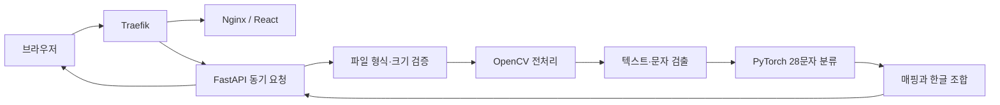

# 아스테룸어 해석기

사진 속 아스테룸 문자를 인식해 순서 있는 한글 자모로 바꾸고, 자모를 한글 음절로 조합하는 바이브코딩 실습 프로젝트다.

현재 1단계 개발환경과 정답 체계를 구현했다. Python 3.14.7/uv 프로젝트, 28개 기본 SVG와 checksum 매핑, 자산 검증 CLI, `갸왜` 자모 조합기, FastAPI health endpoint를 실행할 수 있다. React 화면과 실제 OCR 모델은 아직 구현하지 않았다.

## 강의 시작용 체크포인트

현재 브랜치는 강의에서 나머지 기능을 단계별로 구현하기 위한 시작점이다. 개발환경, 기본 자산, 매핑·문법, 검증 CLI와 문장 sample CSV 양식까지만 제공한다. dataset validator, 합성 이미지 생성, OCR, API와 React UI는 강의 시간에 구현한다.

- [문장 이미지·정답 CSV 템플릿](assets/asterum/datasets/templates/sentence-samples.template.csv)
- 예시 행의 `example_` 값은 실제 이미지 정보로 교체한다.
- CSV 컬럼명은 유지하고 실제 sample을 행으로 추가한다.

## 기획 자료

- [최종 개발 계획과 바이브코딩 지침](https://app.notion.com/p/hiclaps/3bd2652f366780a59e51d72a5c252dff?source=copy_link)
- [Figma 기획서](https://www.figma.com/design/msDfMuQl5oXcE9T39XiIM5/%EC%95%84%EC%8A%A4%ED%85%8C%EB%A3%B8%EC%96%B4-%EB%B2%88%EC%97%AD%EA%B8%B0?node-id=0-1&t=gd5kq1HIqhDFsh0i-1)
- [AI 코딩 에이전트용 구현 프롬프트](docs/ai-agent-build-prompt.md)
- [문자 해석 규칙](docs/asterum-grammar.md)
- [프로젝트 작업 규칙](AGENTS.md)

## 범위

### 목표

- 인쇄물 사진의 아스테룸 문자 28종 검출·분류
- 읽기 순서대로 나온 자모를 한글 음절과 문장으로 조합
- 문자 좌표, confidence, 낮은 신뢰도 후보 표시와 사용자 수정
- 데스크톱과 모바일에서 동작하는 React UI
- 정확도 기준을 통과한 뒤 손글씨 인식을 beta로 제공

### 현재 제외

- 회원, 영구 DB, 번역 기록 저장
- Redis/Celery 비동기 작업 큐
- RAG, LLM 문장 보정, 한국어 사전 기반 추측
- Caddy, Streamlit
- SVG의 일반 재배포·재라이선스와 운영 서비스 배포
- 승인된 영문 매핑 또는 로마자 규칙이 없는 상태의 영문 결과

실습에서는 사용자가 거의 없고 한 요청을 직접 확인하므로 FastAPI가 OCR을 동기 실행한다. 실제 사용량과 처리시간을 측정해 요청 timeout이나 동시 실행 문제가 확인될 때만 작업 큐를 검토한다.

## 기술 스택

| 영역 | 기술 |
| --- | --- |
| Python | 3.14.7, uv, PEP 621, uv_build |
| API | FastAPI, Pydantic v2, Uvicorn |
| 이미지 | OpenCV, Pillow, pillow-heif |
| OCR | PyTorch, text detection, 28-class glyph recognition |
| 품질 | pytest, Ruff, mypy |
| Web | React, TypeScript, Vite, TanStack Query, React Hook Form, Zod, CSS Modules |
| 운영 예정 | Docker Compose, Traefik, Nginx |

Poetry와 `poetry.lock`은 사용하지 않는다. uv가 `.venv`, `pyproject.toml`, `uv.lock`, 명령 실행을 일관되게 관리한다.

## 현재 시작 방법

필요한 도구:

- Python 3.14.7
- uv 0.12.5 이상

프로젝트 디렉터리에서 다음 명령을 실행한다.

```bash
uv sync --frozen
uv run asterum-asset-audit
uv run pytest
```

개발 API 실행:

```bash
uv run asterum-api
```

- liveness: `GET http://127.0.0.1:8000/health/live`
- readiness: `GET http://127.0.0.1:8000/health/ready`
- OpenAPI: `http://127.0.0.1:8000/docs`

아직 사진 해석 endpoint는 없다. health API가 자산 매핑을 정상적으로 읽는지만 확인한다.

## 현재 구조

```text
examples/projects-plli/
├── .agents/skills/asterum-asset-audit/
├── assets/asterum/
│   ├── characters/svg/       # 검토된 기본 문자 28개
│   ├── mapping/              # 문자-한글 자모 매핑과 checksum
│   ├── datasets/             # labels schema와 문장 sample CSV 양식
│   └── licenses/             # 권리 확인 상태
├── backend/
│   ├── src/asterum/
│   │   ├── api/              # FastAPI 진입점
│   │   ├── data/             # 자산 import와 검증
│   │   └── domain/           # 한글 자모 조합
│   └── tests/
├── docs/
├── AGENTS.md
├── pyproject.toml
└── uv.lock
```

`frontend`, `backend/src/asterum/ocr`, `infra`는 해당 개발 단계가 시작될 때 만든다. 비어 있는 예정 폴더를 미리 만들지 않는다.

## 처리 흐름



FastAPI는 한 요청 안에서 검증부터 조합까지 수행한다. 임시 이미지가 필요하면 응답 전에 삭제하고 원본과 결과 문자열을 저장하거나 로그에 남기지 않는다.

## 기본 문자와 매핑

`assets/asterum/mapping/asterum.mapping.v1.json`은 다음 값을 가진다.

- `version`: 매핑 버전
- `characters[].glyph_id`: 파일명과 무관한 안정적인 문자 ID
- `characters[].source_svg`: 기준 SVG의 상대 경로
- `characters[].ko_jamo`: 대응하는 한글 호환 자모
- `characters[].kind`: `consonant` 또는 `vowel`
- `characters[].sha256`: 원본 변경 감지 checksum

현재 자음 14개와 모음 14개를 등록했다. `ㄱ ㅑ ㅇ ㅗ ㅐ`는 복합 모음 규칙을 거쳐 `갸왜`가 된다. 상세 경계 규칙은 [문자 해석 규칙](docs/asterum-grammar.md)을 따른다.

SVG를 변경하거나 다시 가져올 때는 프로젝트 skill과 CLI를 사용한다.

```bash
uv run asterum-import-characters --source "/absolute/path/to/characters"
uv run asterum-asset-audit
```

기존 SVG와 내용이 다르면 import가 중단된다. 검토 없이 `--force`를 사용하지 않는다.

## `labels.json` 계약

`labels.json`은 범용 표준 파일명이 아니라 이 프로젝트가 정의한 OCR 데이터셋 manifest다. 공통 구조는 `assets/asterum/datasets/labels.schema.json`으로 검증한다.

각 sample은 다음 정보를 가진다.

- 정답을 노출하지 않는 ASCII `id`와 이미지 상대 경로
- `printed`, `handwriting`, `synthetic` 입력 종류
- 원본, 작성자·촬영 session을 묶는 `source_id`, `group_id`
- `train`, `validation`, `test` split
- 읽기 순서대로 정렬된 `glyph_id` token
- 이미지 크기, SHA-256, `license_id`

파일 이름은 인쇄물 `prt_src####_img######.png`, 손글씨 `hwr_w####_s####_img######.png`, 합성 `syn_font####_img######.png` 규칙을 사용한다. 파일명에서 정답을 추출하지 않는다. 실제 학습 이미지가 없으므로 현재 빈 `labels.json`과 가짜 sample은 만들지 않았다.

## 개발 단계

1. 완료: Python/uv 환경, 28개 SVG, 매핑·자산 검증, 한글 조합기, health API, sample CSV
2. 강의 실습: 실제 문장 이미지 연결, dataset manifest validator, 합성 인쇄 데이터 생성
3. OpenCV 문자 분리 baseline과 28-class 분류기 학습·평가
4. 동기식 `POST /api/v1/interpret`와 개인정보 삭제 테스트
5. React 데스크톱·모바일 UI와 confidence 수정 흐름
6. Traefik/Nginx/Docker Compose와 end-to-end 검증
7. writer/session이 분리된 자료가 확보되면 손글씨 beta 평가

각 단계는 자동 검증 결과와 남은 위험을 확인한 뒤 다음 단계로 넘어간다.
